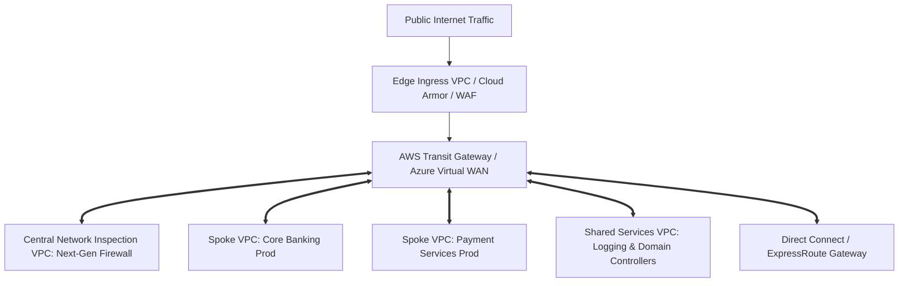

# Enterprise Cloud Networking Architecture

## Executive Summary

Cloud networking provides the software-defined transport fabric connecting compute runtimes, managed datastores, on-premises data centers, and external consumers. Designing enterprise networks requires balancing **blast radius isolation**, **sub-millisecond latency**, **IP address space sustainability**, and **Zero Trust security**.

---

## Enterprise Cloud Network Topology

---

## Deliverables & Guides

| Document | Focus Area | Architectural Impact |
| :--- | :--- | :--- |
| **[VPC & VNet Foundations](vpc-vnet-foundations.md)** | Network topology foundations | Non-overlapping CIDR plans, public vs private subnets |
| **[Routing & NAT Gateways](routing-and-nat.md)** | Egress & Ingress routing | Route tables, NAT Gateway scaling, centralized egress VPCs |
| **[Network Security Controls](network-security-controls.md)** | Micro-segmentation | Stateful Security Groups vs Stateless Network ACLs |
| **[Private Connectivity](private-connectivity.md)** | Isolating cloud PaaS | AWS PrivateLink, Azure Private Link, Google PSC |
| **[Peering & Transit Networks](peering-and-transit.md)** | Inter-VPC communication | VPC Peering vs Hub-and-Spoke Transit Gateways |
| **[VPN & Dedicated Circuits](vpn-and-direct-circuits.md)** | Hybrid connectivity | Direct Connect, ExpressRoute, BGP routing, IPsec failover |
| **[Zero Trust Networking](zero-trust-networking.md)** | Modern security perimeter | Identity-aware proxies, mTLS service mesh, Software-Defined Perimeter |
| **[Firewalls & Traffic Inspection](cloud-firewalls-and-inspection.md)**| Deep packet inspection | AWS Network Firewall, Azure Firewall Premium, IDS/IPS zones |
