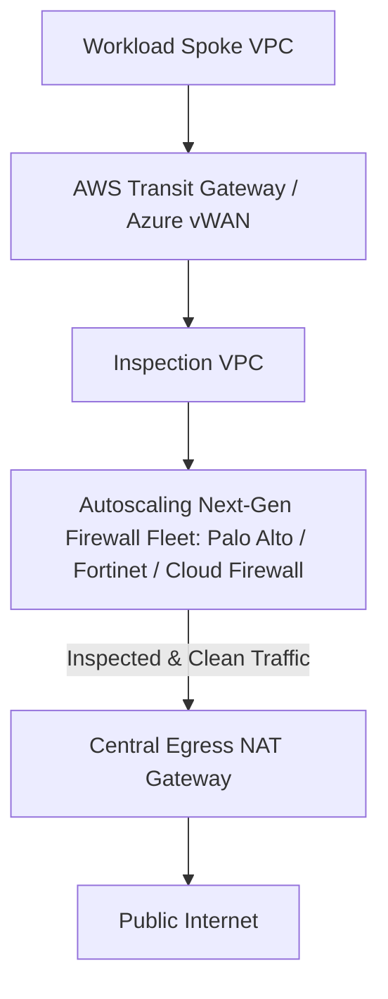

# Cloud Firewalls & Centralized Traffic Inspection

## Executive Summary

Regulated enterprises mandate deep packet inspection (DPI), intrusion detection and prevention (IDS/IPS), and URL filtering for all traffic entering, exiting, or traversing the cloud estate.

---

## 1. Centralized Traffic Inspection Architecture

---

## 2. Inspection Capabilities

1. **Intrusion Detection & Prevention (IDS/IPS)**: Scans network byte streams for known exploit signatures (e.g., Log4j, command injection) and drops offending TCP packets in real time.
2. **TLS Decryption & Inspection**: Manages outbound SSL/TLS decryption using corporate root certificates to inspect encrypted HTTPS egress for data exfiltration and malware command-and-control (C2) beacons.
3. **FQDN Whitelisting**: Blocks all outbound internet traffic from private workloads except to explicitly approved Fully Qualified Domain Names (e.g., `*.github.com`, `registry.npmjs.org`).
