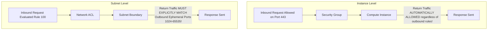

# Network Security Controls: Security Groups vs Network ACLs

## Executive Summary

Cloud network isolation relies on two complementary security layers: **Security Groups** (stateful virtual firewalls) and **Network Access Control Lists - NACLs** (stateless subnet boundary filters).

---

## 1. Stateful vs Stateless Mechanics

---

## 2. Comparative Matrix & Rules of Engagement

| Dimension | Security Groups (AWS / Azure NSG) | Network ACLs (NACL) |
| :--- | :--- | :--- |
| **Operating Layer** | Virtual Network Interface (ENI / NIC) | Subnet Boundary |
| **State Tracking** | **Stateful**: Return traffic automatically permitted. | **Stateless**: Inbound and outbound must be explicitly allowed. |
| **Rule Types** | **Allow Rules Only** (Implicit Deny everything else) | **Allow and Deny Rules** (Evaluated by rule number in order) |
| **Referencing** | Can reference other Security Groups by ID! | IP addresses and CIDR blocks only. |
| **Architectural Role** | Primary defense for service-to-service micro-segmentation. | Coarse subnet-level defense; immediate IP blacklisting during DDoS. |
