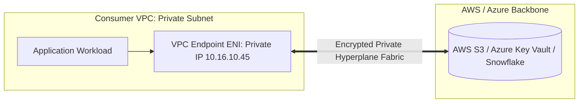

# Private Connectivity: PrivateLink & Private Endpoints

## Executive Summary

Connecting to cloud PaaS services (S3, Azure SQL, BigQuery) or external SaaS platforms over the public internet exposes endpoints to internet-based scanning and incurs costly NAT Gateway data processing fees. **Private Connectivity** projects cloud services directly into private VPC subnets.

---

## 1. PrivateLink Architecture

---

## 2. PrivateLink vs NAT Gateway Economics

- **NAT Gateway Egress**: Traversing NAT Gateways to access S3 or DynamoDB costs $\$0.045/\text{hour} + \$0.045/\text{GB}$ processed. For an enterprise transferring 50 TB monthly, NAT fees exceed $\$2,250/\text{month}$.
- **VPC Gateway Endpoints (S3 & DynamoDB)**: **100% Free of Charge**. Routing traffic to S3 via a Gateway Endpoint routes traffic directly over the private AWS fabric with zero NAT processing fees.
- **Interface Endpoints (PrivateLink)**: Incurs small hourly fee ($\$0.01/\text{hour}$) but eliminates NAT data processing fees and keeps traffic strictly off the public internet.
