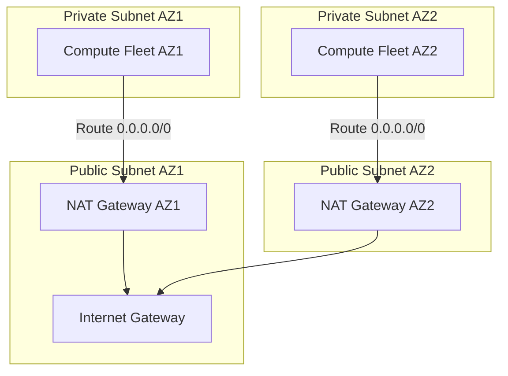

# Cloud Routing Architecture & NAT Gateways

## Executive Summary

Routing tables govern packet flow across subnets and gateways. Managing outbound internet egress for thousands of private compute instances requires designing **scalable, cost-optimized NAT architectures**.

---

## 1. Multi-AZ NAT Gateway Architecture

---

## 2. The NAT Single-Point-of-Failure Trap

- **Anti-Pattern (Single Shared NAT)**: Deploying one NAT Gateway in AZ1 and routing private subnets from AZ2 and AZ3 through it saves $\$32/\text{month}$ per gateway, but:
  1. If AZ1 suffers an outage, **all outbound internet connectivity for the entire region collapses**.
  2. Incurs cross-AZ data transfer fees ($\$0.01/\text{GB}$) for all traffic originating in AZ2/AZ3.
- **Rule**: In production, **deploy exactly one NAT Gateway per Availability Zone** and route each private subnet exclusively to its local AZ NAT Gateway.

---

## 3. Centralized Egress Inspection VPC

At scale (dozens of VPCs), deploying NAT Gateways in every VPC is financially unsustainable. Deploy a **Centralized Egress VPC** attached to AWS Transit Gateway or Azure Virtual WAN, routing all outbound internet traffic through an autoscaling fleet of Next-Gen Firewalls.
