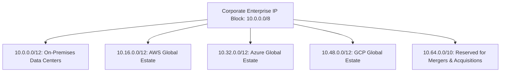
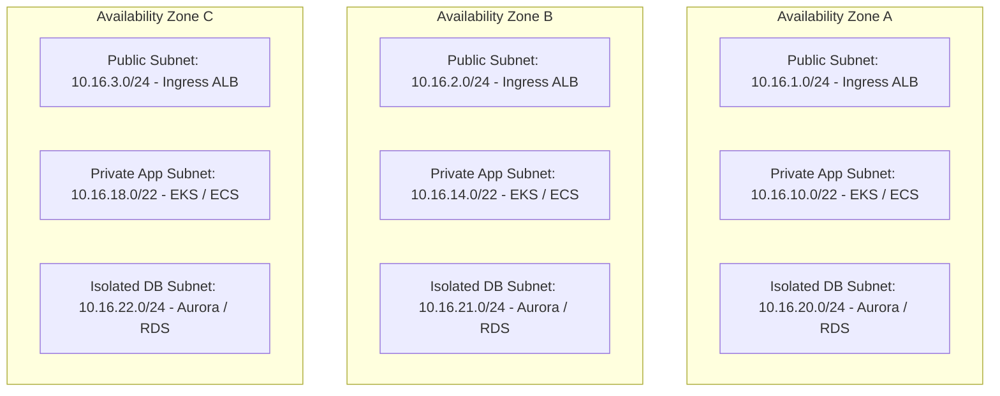

# VPC & VNet Foundations: CIDR Planning & Subnet Architecture

## Executive Summary

IP address exhaustion and overlapping CIDR blocks are among the most expensive and difficult technical debts to remediate in enterprise cloud architecture. Enterprise networking mandates a **globally planned, non-overlapping IP address schema**.

---

## 1. Enterprise RFC 1918 CIDR Allocation Plan

---

## 2. Standard 3-Tier Multi-AZ Subnet Blueprint

Every production VPC/VNet must span a minimum of three Availability Zones with strictly isolated functional tiers:

### Architectural Subnet Rules
1. **Size for Container Density**: Private application subnets must be allocated at least a `/22` (1,022 usable IPs) to accommodate Kubernetes pod churn and prefix delegation without IP starvation.
2. **Zero Route to Internet in Database Tier**: Isolated database subnets must **never contain a default route (`0.0.0.0/0`)** to an Internet Gateway or NAT Gateway.
