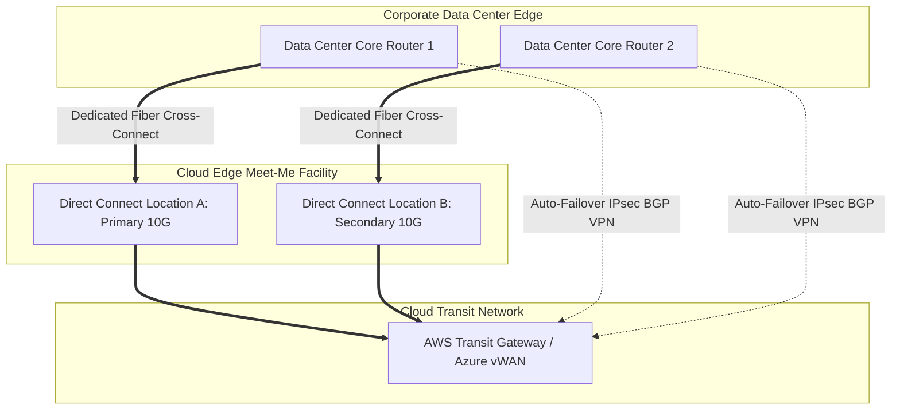

# Hybrid Connectivity: Dedicated Fiber vs Redundant IPsec VPNs

## Executive Summary

Designing enterprise hybrid connectivity requires balancing bandwidth, deterministic latency, high-availability SLAs, and deployment lead times.

---

## 1. Resilient Hybrid Transit Blueprint

---

## 2. BGP Routing Architecture & Failover Mechanics

- **Border Gateway Protocol (BGP)**: Mandate dynamic BGP (Autonomous System Number - ASN) peering over hybrid circuits. Static routing over hybrid links is prohibited because it cannot detect remote fiber conduit breaks.
- **AS-Path Prepending**: Configure the enterprise on-premises routers to prepend their BGP ASN 3 times on the secondary Direct Connect path. Cloud routers will preferentially select the primary circuit and automatically shift traffic to the secondary circuit within sub-second detection windows via **Bidirectional Forwarding Detection (BFD)**.
