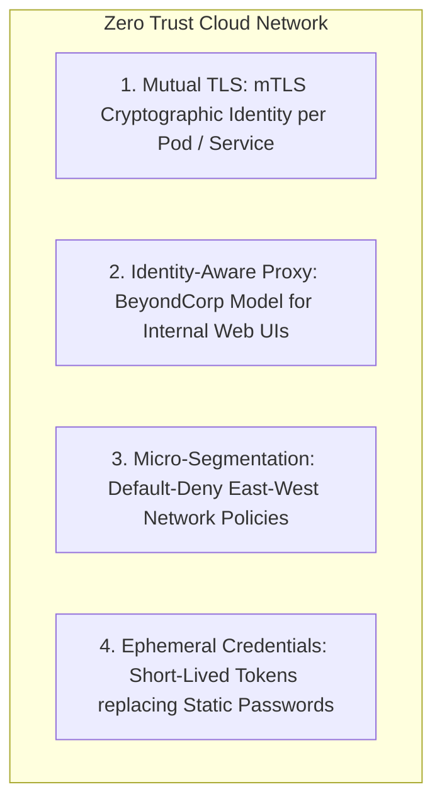
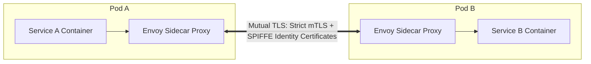

# Zero Trust Cloud Networking & Service Mesh

## Executive Summary

In modern enterprise cloud architecture, the network perimeter is assumed to be compromised. **Zero Trust Networking** enforces continuous verification: **Never Trust, Always Verify**.

---

## 1. Zero Trust Architecture Pillars

---

## 2. Service Mesh Architecture (Istio / Linkerd)

- **Cryptographic Service Identity (SPIFFE/SPIRE)**: Every microservice is issued an ephemeral X.509 certificate encoding its unique identity (`spiffe://cluster.local/ns/prod/sa/payment-service`).
- **Authorization Policies**: Envoy sidecars enforce L7 authorization rules (e.g., Service B accepts only HTTP `POST /charges` requests from identities matching `payment-service`, rejecting all other callers).
