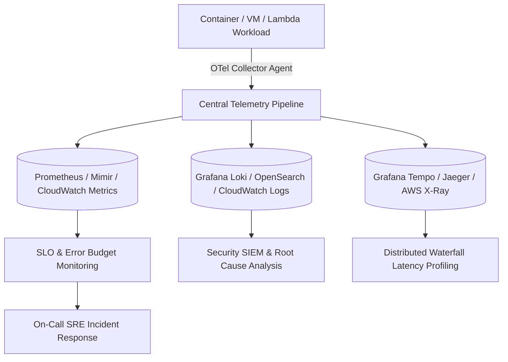

# Cloud Infrastructure Observability Architecture

## Executive Summary

Observability is the measure of how well internal system states can be inferred from external outputs. In distributed enterprise cloud systems, observability is engineered around the **MLET Framework: Metrics, Logs, Events, and Traces**.

---

## Unified Observability Architecture

---

## Deliverables & Guides

| Document | Focus Area | Architectural Impact |
| :--- | :--- | :--- |
| **[Telemetry Architecture](telemetry-architecture.md)** | Core primitives | Metrics, Logs, Traces, Events (MLET framework) |
| **[OpenTelemetry Standard](opentelemetry-standard.md)** | Vendor-neutral telemetry | OTel Collector, OTLP protocol, eliminating vendor lock-in |
| **[SLOs, SLAs & SLIs](slos-slas-slis.md)** | Reliability metrics | Service Level Indicators, SLO error budgets, burn rate alerts |
| **[Distributed Tracing](distributed-tracing.md)** | Trace propagation | W3C trace context, head vs tail sampling, waterfall profiling |
| **[Synthetic Monitoring](synthetic-monitoring.md)** | Proactive detection | Synthetic user journeys, global edge probes, API canaries |
