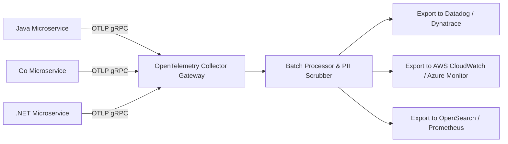

# OpenTelemetry (OTel): Enterprise Telemetry Standardization

## Executive Summary

**OpenTelemetry (CNCF)** is the universal industry standard for generating, collecting, and exporting telemetry data without vendor lock-in.

---

## 1. OpenTelemetry Collector Architecture

---

## 2. The Zero Lock-In Guarantee
- Applications are instrumented exclusively using standard OpenTelemetry SDKs (`opentelemetry-api`).
- If an enterprise migrates from Datadog to Grafana Mimir, **zero application code changes are required**. Only the collector exporter configuration is updated.
