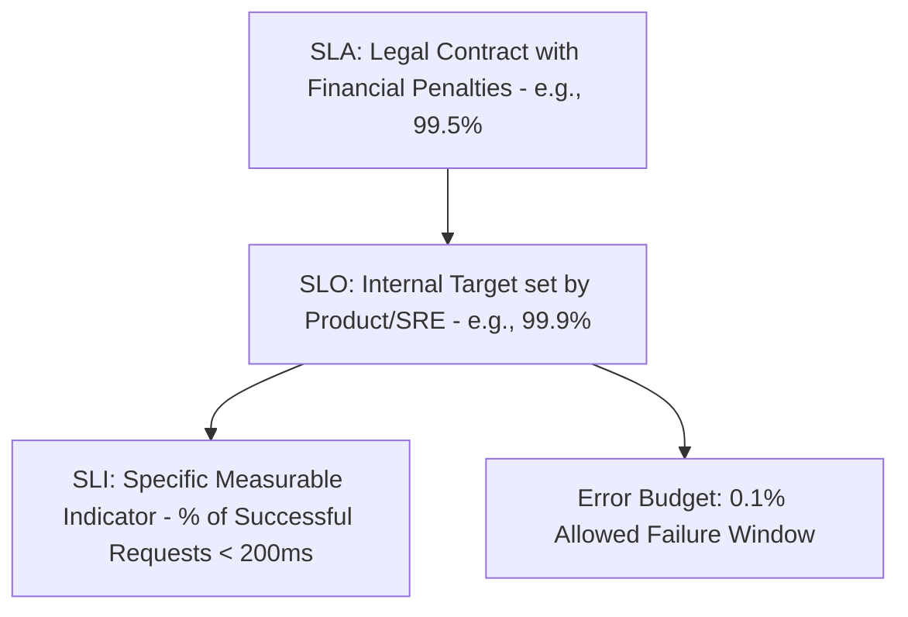

# SLOs, SLAs & Error Budget Engineering

## Executive Summary

Engineering teams should never alert on raw infrastructure metrics (e.g., "CPU > 80%"). Alerts must be driven by **Service Level Objectives (SLOs)** and **Error Budget Burn Rates**.

---

## 1. The Reliability Contract

---

## 2. Multi-Window Multi-Burn-Rate Alerting

- **Traditional Alerts**: Fire when error rate exceeds 1% over 5 minutes. Creates alert fatigue from transient blips.
- **Google SRE Standard (Burn Rate Alerting)**: Alert based on how fast the monthly error budget is being consumed:
  - **Critical Pager**: Error rate consumes **14.4x normal budget** (spends 2% of monthly budget in 1 hour).
  - **Ticket Alert**: Error rate consumes **3x normal budget** (spends 5% of budget in 6 hours).
