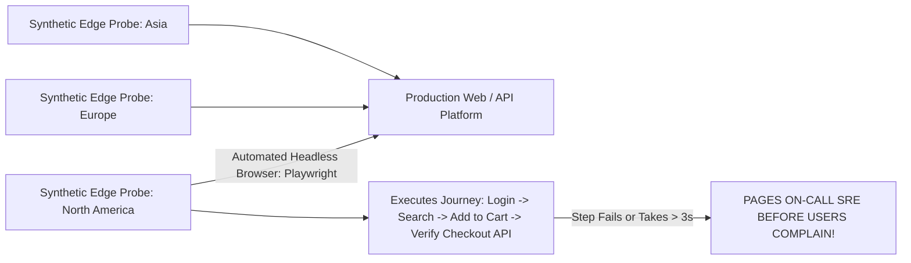

# Synthetic Monitoring & Active Canary Probing

## Executive Summary

Passive telemetry alerts only after real end users experience an outage. **Synthetic Monitoring** simulates critical user journeys continuously from global edge locations to detect failures before customers do.

---

## 1. Synthetic Canary Architecture

