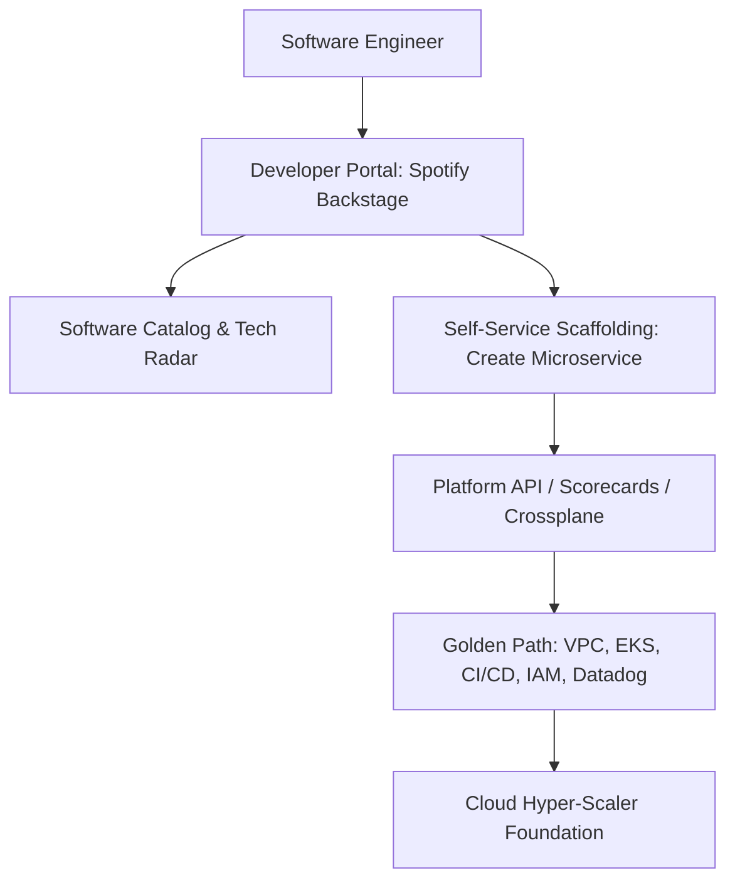

# Platform Engineering & Internal Developer Platforms (IDP)

## Executive Summary

Platform engineering is the discipline of designing and building self-service internal developer platforms (IDP) that provide **Golden Paths**, reducing cognitive load on software engineers while enforcing security and compliance guardrails by design.

---

## IDP Architecture Blueprint

---

## Deliverables & Guides

| Document | Focus Area | Architectural Impact |
| :--- | :--- | :--- |
| **[Internal Developer Platforms](internal-developer-platforms.md)** | IDP architecture | Backstage, developer portals, service catalog, software scorecards |
| **[Golden Paths](golden-paths.md)** | Paved roads | Pre-approved architectural templates, automated scaffolding |
| **[Self-Service Infrastructure](self-service-infrastructure.md)** | Developer autonomy | Replacing IT ticketing with automated platform APIs |
| **[DevOps vs Platform vs SRE](devops-vs-platform-vs-sre.md)** | Team topologies | Roles, responsibilities, and cognitive boundaries |
