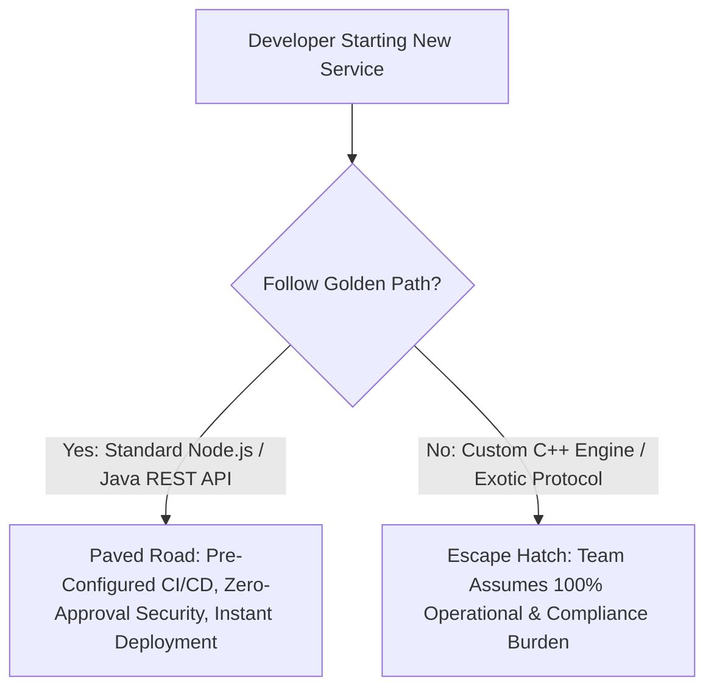

# Golden Paths: Paved Roads for Enterprise Engineering

## Executive Summary

A **Golden Path (Paved Road)** is an opinionated, well-supported, and pre-approved path to building and deploying software inside the enterprise.

---

## 1. Paved Road vs Escape Hatch

---

## 2. The Golden Path Invariant
- **Voluntary Adoption**: The platform team must never force teams to use the Golden Path via corporate mandates. The Golden Path must be so superior, frictionless, and reliable that developers actively prefer it.
