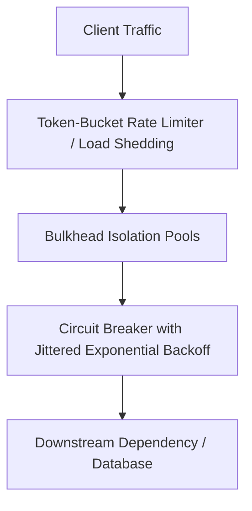

# Cloud Reliability Engineering & Resilience Patterns

## Executive Summary

Cloud reliability engineering operationalizes resilience patterns to ensure that complex distributed systems degrade gracefully during localized failures, avoiding catastrophic systemic cascades.

---

## Core Resilience Architecture

---

## Deliverables & Guides

| Document | Focus Area | Architectural Impact |
| :--- | :--- | :--- |
| **[Cloud Resilience Patterns](cloud-resilience-patterns.md)**| Distributed patterns | Circuit breakers, bulkheads, retries with jitter, load shedding |
| **[Fault Isolation Cells](fault-isolation-cells.md)** | Blast radius architecture | Cell-based architectures, shuffle sharding, cellular containment |
| **[Chaos Engineering](chaos-engineering.md)** | Empirical verification | Chaos Mesh, Litmus, AWS FIS, injecting AZ failure, latency injection |
