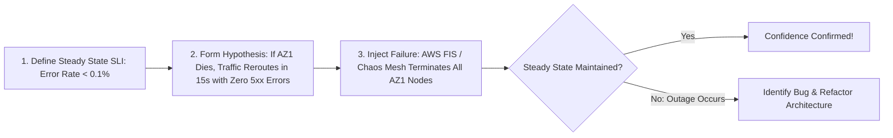

# Chaos Engineering: Injecting Failure to Verify Resilience

## Executive Summary

Chaos engineering is the discipline of experimenting on a system in order to build confidence in the system's capability to withstand turbulent conditions in production.

---

## 1. Chaos Experimentation Workflow

