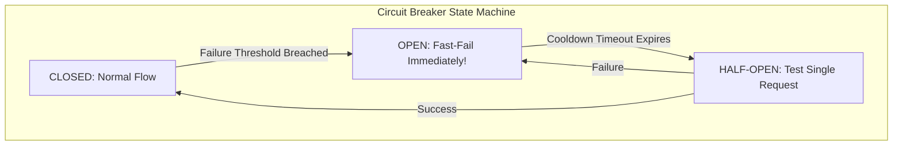

# Distributed Resilience Patterns: Circuit Breakers, Bulkheads & Jitter

## Executive Summary

Distributed systems fail continuously. Implementing battle-tested resilience patterns ensures failures remain localized.

---

## 1. The Five Essential Resilience Patterns

### 1. Circuit Breaker
Stops calling a failing downstream dependency immediately once error thresholds are breached, preventing connection pool exhaustion and allowing the downstream service time to recover.

### 2. Retries with Exponential Backoff and Full Jitter
Never retry synchronously in a tight loop. Add randomized jitter to prevent the **Thundering Herd** problem:
$$t_{\text{sleep}} = \text{random}(0, \min(M, B \times 2^{\text{attempt}}))$$

### 3. Bulkheads
Partition thread pools and connection pools so that a failure in one feature (e.g., slow PDF report generation) cannot exhaust the global thread pool and crash the core checkout engine.

### 4. Load Shedding
When CPU or request queues exceed 85%, drop non-essential traffic (background analytics, recommendations) with HTTP 429 to prioritize critical transaction completions.
