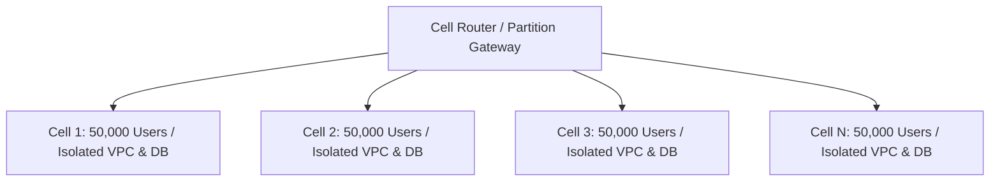

# Fault Isolation Cells & Shuffle Sharding

## Executive Summary

Cell-based architecture partitions an enterprise platform into autonomous, self-contained mini-instances ("cells") to guarantee that a catastrophic outage impacts only a tiny fraction of users.

---

## 1. Cell-Based Architecture Topology

- If Cell 2 suffers complete database corruption, **only 2% of users are impacted**; 98% of users continue operating normally.

---

## 2. Shuffle Sharding
Assign each customer a virtual shard consisting of a unique combination of 2 nodes out of a 10-node fleet. This mathematical distribution provides 99.999% isolation against "poison pill" requests.
