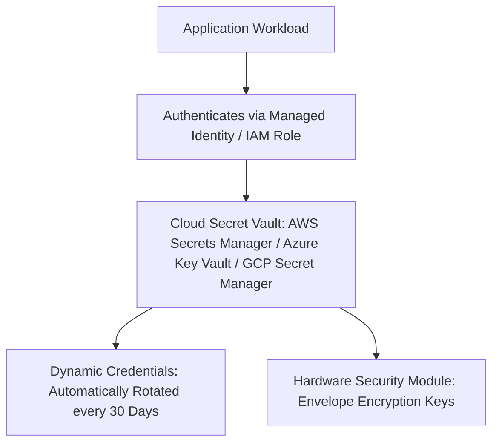

# Enterprise Secrets & Key Management Architecture

## Executive Summary

Secrets management governs the lifecycle of sensitive credentials—database passwords, API tokens, cryptographic encryption keys, and SSL/TLS certificates. Enterprise architecture dictates that **secrets must never exist in plaintext in source code, configuration files, or container images**.

---

## Secrets Management Topology

---

## Deliverables & Guides

| Document | Focus Area | Architectural Impact |
| :--- | :--- | :--- |
| **[Secrets Lifecycle Management](secrets-lifecycle.md)** | Credential lifecycle | Generation, injection, automated rotation, auditing, purging |
| **[KMS & Envelope Encryption](kms-and-envelope-encryption.md)** | Cryptographic keys | Hardware Security Modules, Customer Master Keys, DEK mechanics |
| **[Automated Secret Rotation](automated-secret-rotation.md)** | Zero-downtime rotation | Dual-credential rotation, Lambda orchestrators, database sync |
| **[Secret Exposure Prevention](secret-exposure-prevention.md)** | Preventing leakage | Pre-commit hooks, git-secrets, memory hygiene, runtime scraping |
