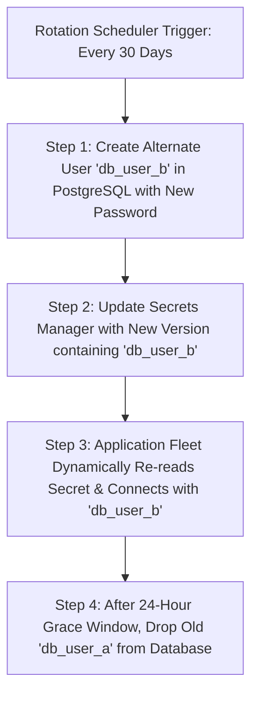

# Automated Secret Rotation & Zero-Downtime Synchronization

## Executive Summary

Rotating database credentials without application downtime requires a **Dual-Credential Rotation Architecture**.

---

## 1. Dual-Credential Zero-Downtime Rotation Pattern

---

## 2. Architectural Guardrails
- **In-Flight Connection Survival**: Existing connection pools connected under the old credential must remain active until the application gracefully cycles idle connections.
- **Automated Rollback**: If the rotation orchestrator fails to verify the new credential against the database, the rotation is immediately aborted, preserving the active credential and alerting the on-call SRE.
