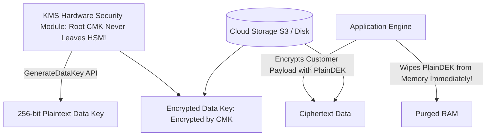

# KMS & Envelope Encryption Architecture

## Executive Summary

Key Management Service (KMS) leverages FIPS 140-2/3 validated Hardware Security Modules (HSMs) to protect master cryptographic keys. Data encryption at scale relies on **Envelope Encryption**.

---

## 1. Envelope Encryption Mechanics

---

## 2. Why Envelope Encryption is Mandatory
1. **Network Performance**: Passwords and encryption keys are tiny (256-bit). Passing gigabytes of application data across the network to KMS for encryption causes network bottlenecks.
2. **KMS Quota Preservation**: Encrypting millions of individual records directly in KMS exhausts API rate limits. Envelope encryption calls KMS only once to acquire the DEK, using it to encrypt thousands of local records in application memory.
