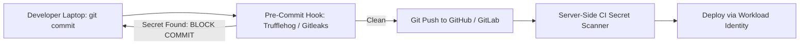

# Secret Exposure Prevention: CI/CD Guardrails & Memory Hygiene

## Executive Summary

Preventing secret exposure requires defense-in-depth across developer workstations, version control, CI/CD pipelines, and runtime memory.

---

## 1. Multi-Stage Secret Prevention Pipeline

---

## 2. Runtime Memory Hygiene

- **Prevent Core Dump Secret Leakage**: Configure operating systems to disable core dumps (`ulimit -c 0`) for sensitive cryptographic processes to prevent secrets from being written to unencrypted disk on process crash.
- **Process Memory Locking**: In languages with direct memory management (C, Go, Rust), use `mlock()` to prevent sensitive cryptographic keys in memory from being swapped out to unencrypted physical swap disks.
