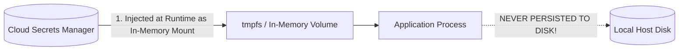

# Secrets Lifecycle Architecture: Generation, Injection & Auditing

## Executive Summary

Managing secrets requires a complete lifecycle framework ensuring credentials are generated securely, injected ephemerally at runtime, rotated automatically, and revoked immediately upon compromise.

---

## 1. Modern Secret Injection Architecture

---

## 2. Secrets Anti-Patterns vs Architectural Standards

| Anti-Pattern | Vulnerability Impact | Architectural Standard |
| :--- | :--- | :--- |
| **Hardcoded Secrets in Git** | Immediate compromise upon repository leak. | Store secrets strictly in managed cloud vaults. |
| **Secrets in Environment Variables** | Leaked via crash dumps, child process forks, and `/proc/1/environ`. | Mount secrets as ephemeral in-memory files (`tmpfs`) with strict read permissions. |
| **Long-Lived Static Passwords** | Breached passwords remain valid for years. | Enforce automated 30-day credential rotation. |
| **Shared Application Credentials** | Lack of accountability; impossible to revoke for one service. | Dedicated micro-credentials per service identity. |
