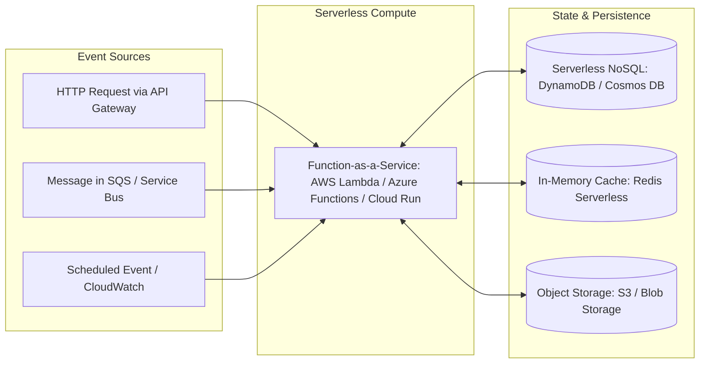

# Enterprise Serverless Architecture

## Executive Summary

Serverless architecture is an operational paradigm where the cloud provider manages infrastructure provisioning, maintenance, OS patching, and elastic scaling, billing strictly for resource consumption while code executes.

---

## Serverless Architecture Topology

---

## Deliverables & Guides

| Document | Focus Area | Architectural Impact |
| :--- | :--- | :--- |
| **[FaaS Architecture](faas-architecture.md)** | Core execution internals | MicroVM isolation, runtime bootstrap, cold start mechanics |
| **[Serverless Containers](serverless-containers.md)** | Containerized serverless | Google Cloud Run, AWS Fargate, Azure Container Apps |
| **[Event-Driven Serverless](event-driven-serverless.md)** | Reactive serverless integration | Stream batching, event filters, push vs pull patterns |
| **[Cold Starts & Concurrency](cold-starts-and-concurrency.md)** | Latency engineering | Memory sizing, SnapStart, provisioned concurrency tuning |
| **[State Management](state-management.md)** | Distributed state & sagas | Step Functions, Durable Functions, externalized state stores |
| **[Serverless Observability](serverless-observability.md)** | Distributed telemetry | Tracing async events, cold-start metrics, correlation |
| **[Serverless Security](serverless-security.md)** | Micro-perimeter security | Least privilege execution roles, ephemeral sandbox security |
| **[Serverless Cost Economics](serverless-cost-economics.md)** | Financial modeling | Pay-per-ms math, the economic crossover curve vs containers |
| **[Serverless vs Containers vs VMs](serverless-vs-containers-vs-vms.md)**| Definitive comparison | Multi-vector architectural comparison matrix |
