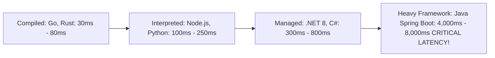

# Serverless Cold Starts & Concurrency Engineering

## Executive Summary

A **cold start** occurs when a serverless platform initializes a new execution environment (downloading code, launching microVM, bootstrapping runtime, initializing database connection pools) before serving the first request.

---

## 1. Cold Start Duration by Runtime

---

## 2. Mitigation Strategies

1. **Lightweight Frameworks**: Abandon heavy enterprise frameworks relying on runtime reflection (e.g., traditional Spring Boot). Adopt lightweight alternatives (Quarkus Native, Micronaut, Go standard library, Node.js).
2. **AWS SnapStart**: Enables snapshotting microVM memory state after class initialization. Reduces Java cold starts from 7 seconds to $< 180\text{ ms}$ at zero additional cost.
3. **Provisioned Concurrency**: Allocate pre-warmed execution instances for latency-critical customer-facing payment APIs.
