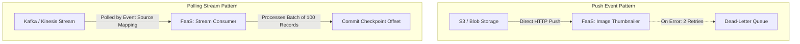

# Event-Driven Serverless Integration Patterns

## Executive Summary

Serverless architectures thrive when coupled to asynchronous event sources. Designing event-driven serverless platforms requires handling **idempotency**, **concurrency throttling**, and **poison pill isolation**.

---

## 1. Event Source Ingestion Patterns

---

## 2. Idempotent Processing Enforcement

Because distributed cloud event systems guarantee **at-least-once delivery**, serverless functions will occasionally receive duplicate invocations.
- **Rule**: Every event payload must carry a unique business identifier (`event_id` or `transaction_id`).
- Before executing business logic, the function executes a conditional atomic write (`INSERT IF NOT EXISTS`) to a high-speed key-value store (DynamoDB or Redis) with a 24-hour TTL. If the key exists, the invocation is safely discarded as a duplicate.
