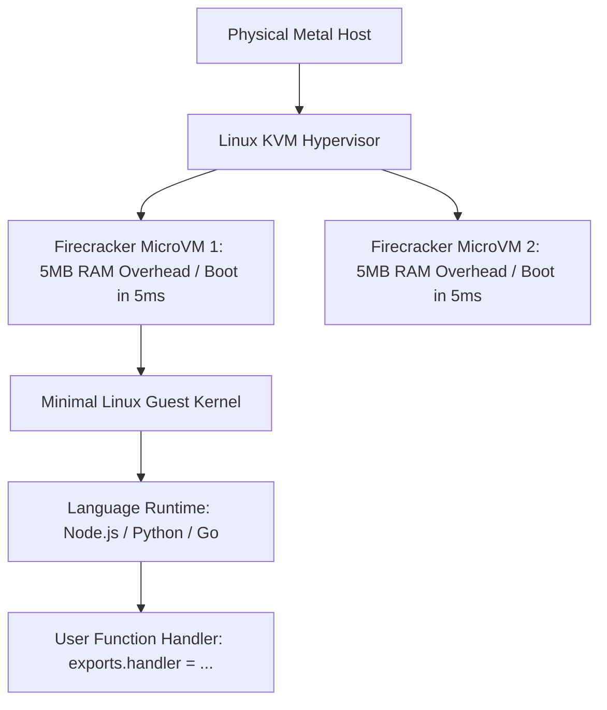

# Function-as-a-Service (FaaS) Architecture

## Executive Summary

Function-as-a-Service (FaaS) executes individual application functions in response to discrete events. Platforms utilize lightweight **MicroVMs** (e.g., AWS Firecracker, Google gVisor) to provide hardware-level virtualization isolation with container-level startup speeds.

---

## 1. Firecracker MicroVM Execution Architecture

---

## 2. MicroVM Advantages
- **Security Isolation**: Unlike standard container runtimes that share the host kernel, MicroVMs provide distinct virtualized guest kernels, eliminating container breakout risks in multi-tenant environments.
- **Ultra-Fast Provisioning**: Boots a secure microVM in under $5\text{ milliseconds}$ with less than $5\text{ MB}$ of memory overhead.
