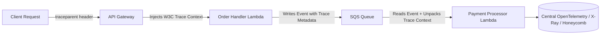

# Serverless Observability & Distributed Tracing

## Executive Summary

Debugging distributed serverless applications requires tracing requests across asynchronous boundaries (queues, event buses, object storage triggers) where traditional in-process thread profilers cannot operate.

---

## 1. Async Trace Propagation

---

## 2. Telemetry Best Practices

1. **Structured JSON Logging**: Always write logs to `stdout` as structured JSON containing `trace_id`, `service_name`, `cold_start: boolean`, and `duration_ms`.
2. **Asynchronous Metric Ingestion**: Never make synchronous HTTP network calls to external telemetry backends within a serverless request path. Emit metrics to stdout using cloud-native embedded formats (AWS EMF, Google Cloud Logging labels) to avoid inflating invocation durations.
