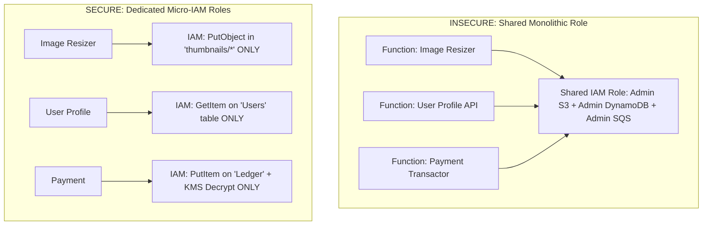

# Serverless Security & Micro-Perimeters

## Executive Summary

Serverless compute shifts security from network perimeter defense to **granular identity authorization**. Each individual function must be encapsulated within a minimal micro-perimeter.

---

## 1. The Micro-IAM Role Principle

### Security Guardrails
- **1 Function = 1 Dedicated IAM Role**: Never share IAM execution roles across multiple serverless functions.
- **Ephemeral Storage Security**: Sensitive decrypted memory or temporary files stored in `/tmp` persist between warm invocations. Always overwrite or purge temporary directories before the function handler returns.
