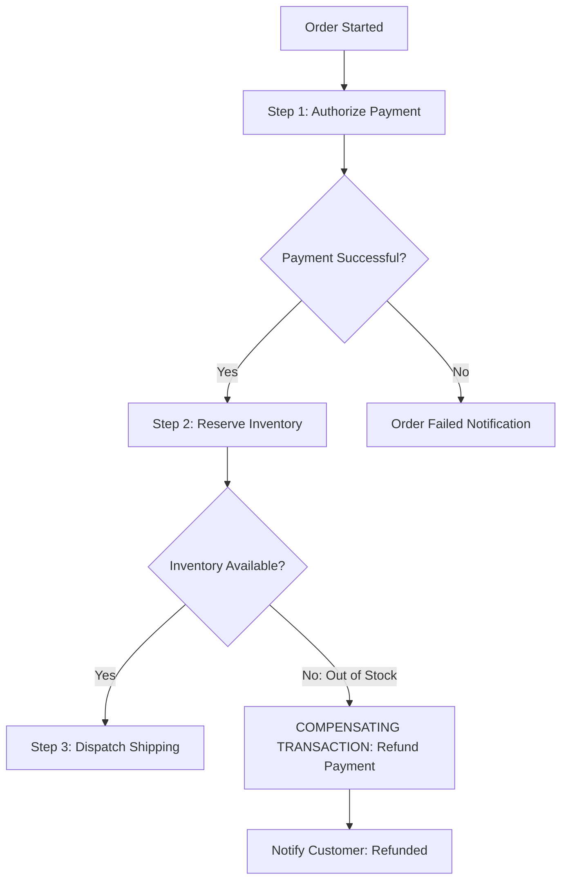

# Serverless State Management & Workflow Orchestration

## Executive Summary

Functions are stateless. Coordinating multi-step business transactions (e.g., e-commerce order processing: Payment $\rightarrow$ Inventory $\rightarrow$ Shipping) using synchronous point-to-point HTTP calls creates brittle distributed failure modes. Enterprise state management requires **Saga State Machines**.

---

## 1. Serverless Saga Orchestration

---

## 2. Workflow Orchestration Engines

- **AWS Step Functions**: Declarative JSON state machines managing retries, exponential backoffs, human approval tasks, and compensating transactions with visual execution histories.
- **Azure Durable Functions**: Code-centric orchestrator functions using C#, TypeScript, or Python generators to execute long-running workflows with automated checkpointing to Azure Storage.
