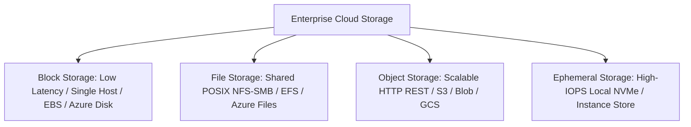

# Enterprise Storage Architecture

## Executive Summary

Enterprise storage architecture encompasses the selection, lifecycle management, and disaster recovery of **Block Storage**, **File Storage**, **Object Storage**, and **Ephemeral High-Speed Scratch Tiers**.

---

## Storage Architecture Taxonomy

---

## Deliverables & Guides

| Document | Focus Area | Architectural Impact |
| :--- | :--- | :--- |
| **[Block vs File vs Object](block-vs-file-vs-object.md)** | Core storage trade-offs | Latency, throughput, sharing protocols, durability |
| **[Object Storage Architecture](object-storage-architecture.md)**| S3/Blob/GCS engineering | Multipart upload, byte-range requests, prefix scaling |
| **[File Storage Architecture](file-storage-architecture.md)**| Shared filesystem design | NFSv4, SMB, Azure NetApp Files, POSIX lock semantics |
| **[Ephemeral Scratch Storage](ephemeral-storage.md)** | Local NVMe performance | Microsecond IOPS, ephemeral scratch buffers, volatility risks |
| **[Storage Tiering & Lifecycle](storage-tiering-and-lifecycle.md)**| FinOps storage optimization | Automated tier transitions, retrieval fees, intelligent tiering |
| **[Storage Backup & Disaster Recovery](storage-backup-and-dr.md)**| Resiliency & compliance | Immutable WORM locks, cross-region replication, air-gapping |
| **[Storage Selection Framework](storage-decision-framework.md)** | Measurable decision framework | Quantitative scoring matrix for enterprise storage selection |
