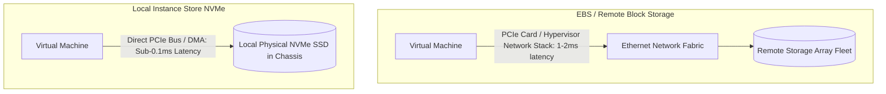

# Ephemeral Scratch Storage: Local NVMe & Instance Stores

## Executive Summary

Ephemeral storage (AWS EC2 Instance Store, Azure Temp Disks, GCP Local SSD) consists of high-speed NVMe solid-state drives physically installed directly inside the host hypervisor chassis.

---

## 1. Network Block Storage vs Local NVMe

---

## 2. The Volatility Risk & Architecture Rules

- **Volatility Reality**: When a VM instance is stopped, rebooted across hosts, or terminated, **all data on the local NVMe drive is cryptographically wiped and permanently lost**.
- **Supported Workloads**:
  1. Temporary scratch space (video transcoding buffers, sorting temporary files).
  2. Distributed databases with application-level quorum replication (e.g., Cassandra, Elasticsearch, CockroachDB), where loss of a single local node is automatically healed by re-replicating from peers.
- **Prohibited Workloads**: Single-instance relational databases or any system lacking automated multi-node data redundancy.
