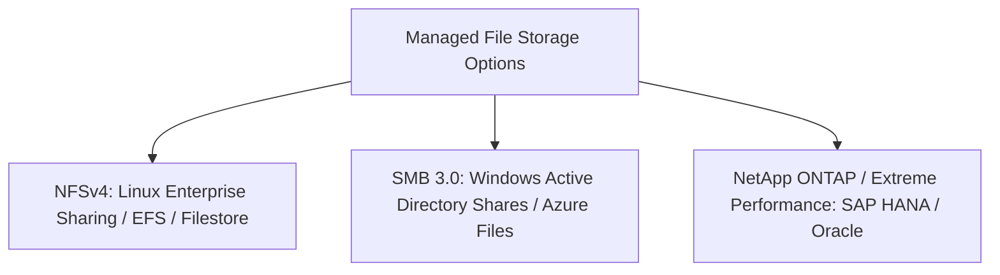

# File Storage Architecture: NFS, SMB & POSIX Semantics

## Executive Summary

Managed cloud file storage (Amazon EFS, Azure Files, Google Cloud Filestore, Azure NetApp Files) provides shared filesystem hierarchies conforming to POSIX standards.

---

## 1. File Storage Protocols & Use Cases

---

## 2. Performance Modes: General Purpose vs Max I/O

- **General Purpose**: Optimized for lowest latency per operation ($< 3\text{ ms}$). Best for web serving environments and CMS platforms (WordPress).
- **Max I/O**: Sacrifices baseline latency (5–15 ms) to scale total cluster throughput to tens of thousands of IOPS. Required for big data batch processing, genomic sequencing, and large parallel simulation rendering.
