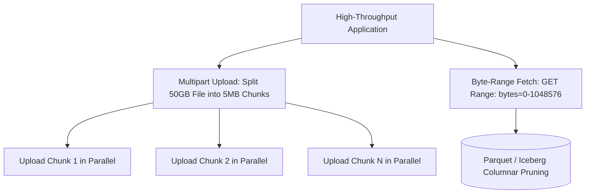

# Object Storage Architecture: Multipart, Byte-Range & Prefix Scaling

## Executive Summary

Object storage stores unstructured data as discrete objects containing a unique key, data payload, and arbitrary metadata. High-throughput performance requires mastering **prefix scaling**, **multipart uploads**, and **byte-range parallelism**.

---

## 1. Object Storage Internals & High-Throughput Engineering

---

## 2. Partition Key & Prefix Scaling Mechanics

- **How Prefix Partitioning Works**: Object storage automatically partitions data by the object key's string prefix.
- In Amazon S3, each unique partition prefix supports **3,500 PUT/POST/DELETE requests/sec** and **5,500 GET requests/sec**.
- **Architectural Rule for High-Throughput**: To scale beyond 5,500 GETs/sec, distribute objects across distinct prefixes (e.g., `s3://my-bucket/orders/2026/01/...`, `s3://my-bucket/orders/2026/02/...`).
- **Byte-Range Requests**: Big Data query engines (Trino, Athena, BigQuery) never download multi-gigabyte files in full. They issue parallel HTTP `Range: bytes=X-Y` requests to fetch only specific columnar metadata footers from Parquet files.
