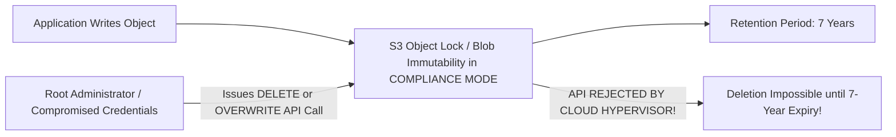

# Storage Resiliency, WORM Compliance & Ransomware Defense

## Executive Summary

Modern cybersecurity threats mandate that enterprise storage architectures provide mathematically provable defense against ransomware, accidental deletion, and rogue administrator destruction.

---

## 1. Immutable WORM Architecture (Write Once, Read Many)

---

## 2. The Three Vaulting Defenses

1. **Compliance Mode WORM**: In Compliance Mode, not even the root AWS account owner or cloud provider support staff can delete an object or reduce the retention period before the timestamp expires (satisfies SEC Rule 17a-4).
2. **Cross-Region Replication (CRR) to Isolated Account**: Automatically replicate all backups and transaction logs asynchronously to a physically separate AWS account located in a secondary region with distinct cryptographic KMS keys.
3. **Air-Gapped Backup Vault**: The backup account maintains no network trust relationships, IAM roles, or peering connections with the production environment.
