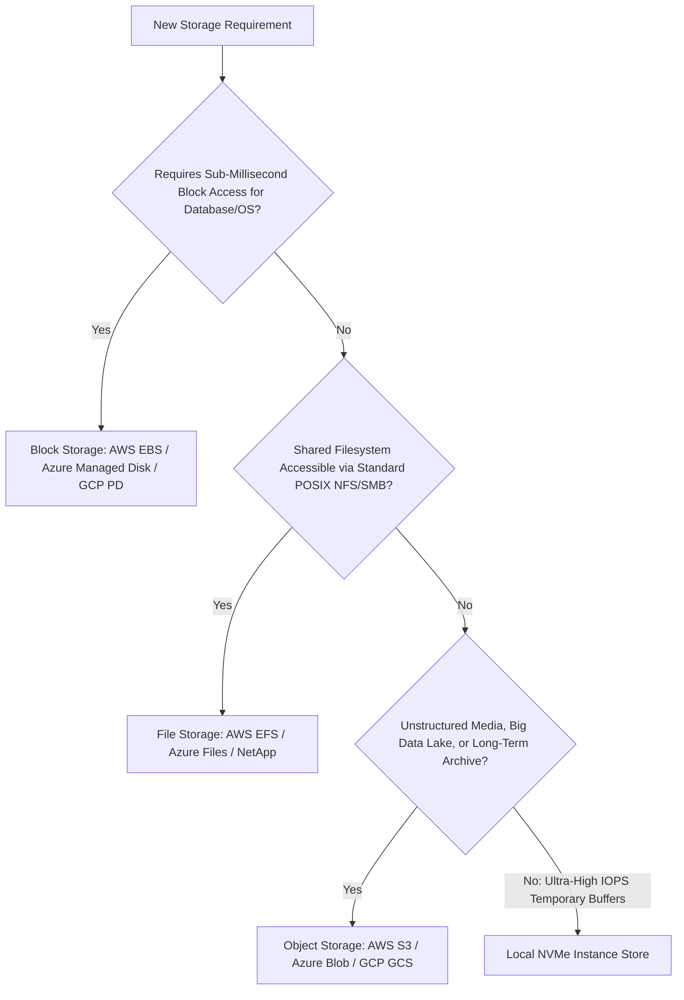

# Storage Selection Decision Framework

```yaml
status: approved
decision_type: framework
scope: enterprise-storage
owners: architecture-review-board
review_cadence: semi-annual
```

## Executive Summary

This framework provides an architectural scorecard to select the optimal storage engine based on throughput, latency, multi-tenant sharing, and cost constraints.

---

## 1. The Storage Decision Tree



---

## 2. Measurable Selection Matrix

| Criterion | Block Storage | File Storage | Object Storage | Ephemeral NVMe |
| :--- | :---: | :---: | :---: | :---: |
| **Latency Tolerance** | $< 1\text{ ms}$ | $2 - 10\text{ ms}$ | $50 - 150\text{ ms}$ | $< 0.1\text{ ms}$ |
| **Max Concurrent Hosts**| 1 (Clustered: 2-16) | Thousands | Millions | 1 |
| **Random I/O Performance**| High (IOPS provisioned)| Moderate | Poor (Byte-range only) | **Extreme** |
| **Data Immutability** | No | No | **Yes (WORM / Versioning)**| No |
| **Unit Cost Index** | $10\times$ | $15\times$ | **$1\times$ (Lowest Cost)** | Included in VM fee |
