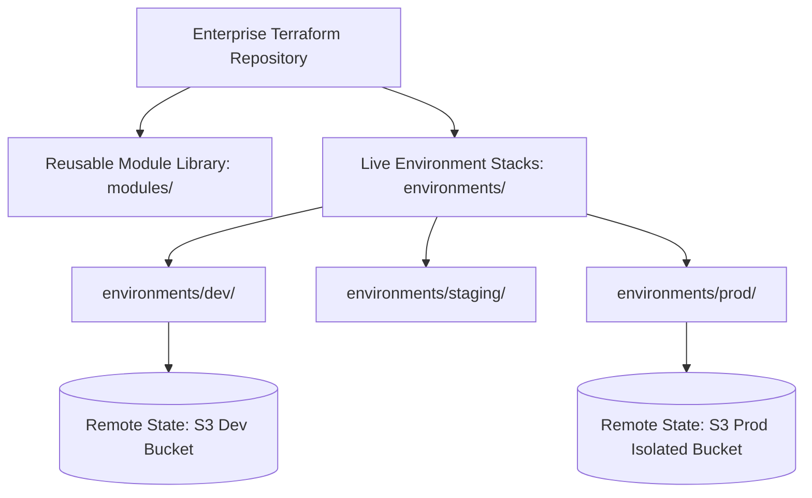

# Enterprise Terraform Architecture

## Executive Summary

HashiCorp Terraform and OpenTofu are the standard infrastructure provisioning tools in enterprise cloud engineering. Designing enterprise Terraform architectures requires rigorous **repository layouts**, **remote state locking**, and **environment isolation**.

---

## Enterprise Terraform Architecture

---

## Deliverables & Guides

| Document | Focus Area | Architectural Impact |
| :--- | :--- | :--- |
| **[Architecture & Internals](architecture-and-internals.md)** | Core engine mechanics | Providers, dependency DAG, state file serialization |
| **[Enterprise Repo Structure](enterprise-repo-structure.md)** | Codebase layout | Root modules, child modules, environment separation |
| **[Remote State & Locking](remote-state-and-locking.md)** | State resilience | S3 + DynamoDB, Azure Blob leases, state access governance |
| **[Workspaces vs Directories](workspaces-vs-directories.md)** | Environment isolation | Why directory-per-environment dominates workspaces in prod |
| **[Secrets in Terraform](secrets-in-terraform.md)** | State file security | Preventing plaintext secrets in state; Vault dynamic credentials |
| **[CI/CD Pipelines](ci-cd-pipelines.md)** | Automated delivery | Plan on PR, approval gates, apply on merge, drift schedules |
