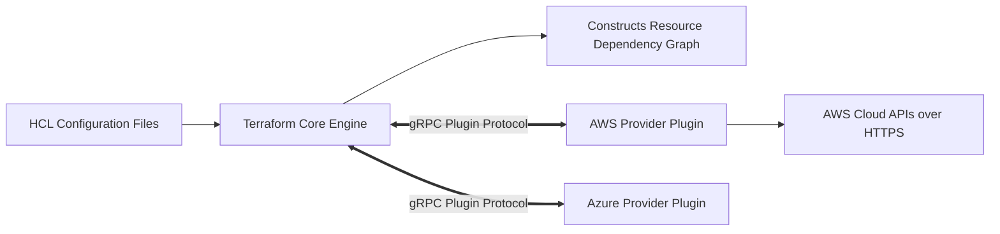

# Terraform Internals: Core, Providers & Dependency Graphs

## Executive Summary

Understanding how Terraform constructs its internal **Directed Acyclic Graph (DAG)** is essential for diagnosing dependency cycles and performance bottlenecks.

---

## 1. The Core vs Provider Architecture

---

## 2. Parallelism & Dependency Resolution

- **Implicit Dependencies**: Terraform inspects references between resources (e.g., `subnet_id = aws_subnet.private.id`) and automatically schedules the subnet creation before instance creation.
- **Explicit Dependencies (`depends_on`)**: Use sparingly. Overusing `depends_on` serializes graph execution, turning a 2-minute parallel apply into a 25-minute sequential slog.
