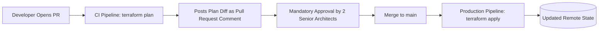

# Terraform CI/CD Pipelines & Automated Delivery

## Executive Summary

Enterprise infrastructure changes must never be executed from developer laptops. All executions must route through automated, audited CI/CD pipelines.

---

## 1. Pull Request & Deployment Workflow

---

## 2. Guardrails for Automated Execution

- **Saved Plan Execution**: The production apply step must execute the exact binary plan file generated during review (`terraform apply tfplan.binary`). It must never execute an unreviewed raw `terraform apply`.
- **Concurrency Serialization**: CI/CD pipelines must enforce a concurrency queue of 1 for each state stack to prevent race conditions.
