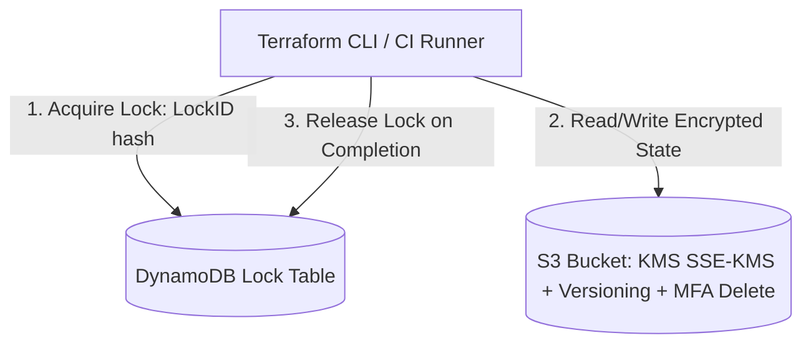

# Terraform Remote State & Distributed Locking

## Executive Summary

Terraform state files contain sensitive data (passwords, private keys, resource IDs). Securing and locking state files is critical for multi-engineer collaboration.

---

## 1. S3 + DynamoDB State Architecture

---

## 2. State File Security Baselines

1. **KMS Encryption at Rest**: Encrypt state buckets with dedicated Customer Managed Keys (CMK).
2. **Strict S3 Bucket Policies**: Deny all access to the state bucket except to the specific IAM execution role assumed by the CI/CD pipeline runner.
3. **MFA Delete & Versioning**: Enable S3 Object Versioning and MFA Delete to prevent accidental or malicious destruction of historical state snapshots.
