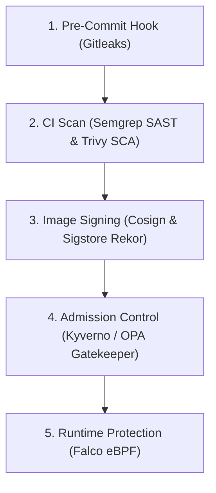
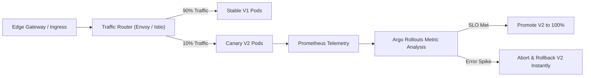

# DevOps Architecture Diagrams & Visual Topologies

Curated Mermaid diagrams visualizing the enterprise DevOps delivery lifecycle, infrastructure topologies, and security boundaries.

## 1. Enterprise Continuous Delivery Flow

```mermaid
flowchart LR
    Dev["Developer Workstation"] -->|Git Push| Git["Enterprise Git (GitHub/GitLab)"]
    Git -->|Webhook| CI["Autoscaling CI Runners (K8s ARC)"]
    subgraph CI Pipeline
        Build["Build & Compile"] --> Test["Automated Tests"]
        Test --> Sec["Security Gates (SAST/Trivy)"]
        Sec --> Sign["Sign OCI (Cosign)"]
    end
    CI --> CI Pipeline
    Sign --> Reg["Immutable Artifact Registry"]
    Reg -->|Sync| GitOps["GitOps Controller (ArgoCD)"]
    GitOps -->|Reconcile| K8s["Production Kubernetes Cluster"]
```

## 2. DevSecOps Shift-Left Security Fabric



## 3. Internal Developer Platform (IDP) Topology

```mermaid
flowchart TD
    DevUser["Software Engineer"] -->|Self-Service| Portal["Developer Portal (Backstage)"]
    Portal -->|Scaffold / API| PlatformAPI["Platform Orchestration Engine"]
    subgraph Platform Engine
        GitOpsOrch["ArgoCD"]
        IaCOrch["Crossplane / Terraform"]
        SecretOrch["HashiCorp Vault"]
    end
    PlatformAPI --> Platform Engine
    Platform Engine --> Cloud["Multi-Cloud Infrastructure (AWS / Azure / GCP)"]
```

## 4. Progressive Canary Delivery Topology



## Related Resources
- [Master Architecture Diagrams (INDEX.md)](../../INDEX.md#17-diagrams)
- [Reference Architectures](../reference-architectures/README.md)
