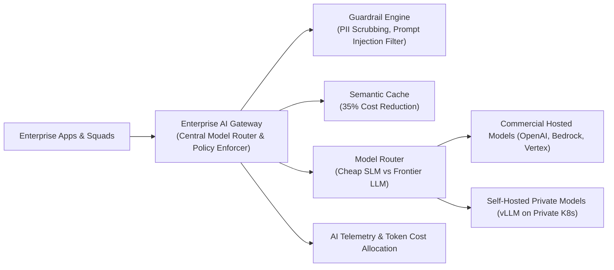

# AI Capability Map & Enterprise Governance

How Enterprise Architects establish the AI Control Plane to prevent data leakage, model hallucinations, and runaway API costs.

---

## 1. The Enterprise AI Control Plane Architecture

---

## 2. EU AI Act Compliance Scorecard
Every AI use case deployed in the enterprise must be evaluated against the regulatory risk tiers:
* **Unacceptable Risk**: Real-time biometric surveillance, cognitive behavioral manipulation $	o$ **Prohibited**.
* **High Risk**: Credit scoring, CV hiring triage, medical diagnostic support $	o$ **Mandatory human-in-the-loop, bias audits, continuous logging**.
* **Limited / Minimal Risk**: Customer support summarization, code generation copilots $	o$ **Transparency notice required**.
