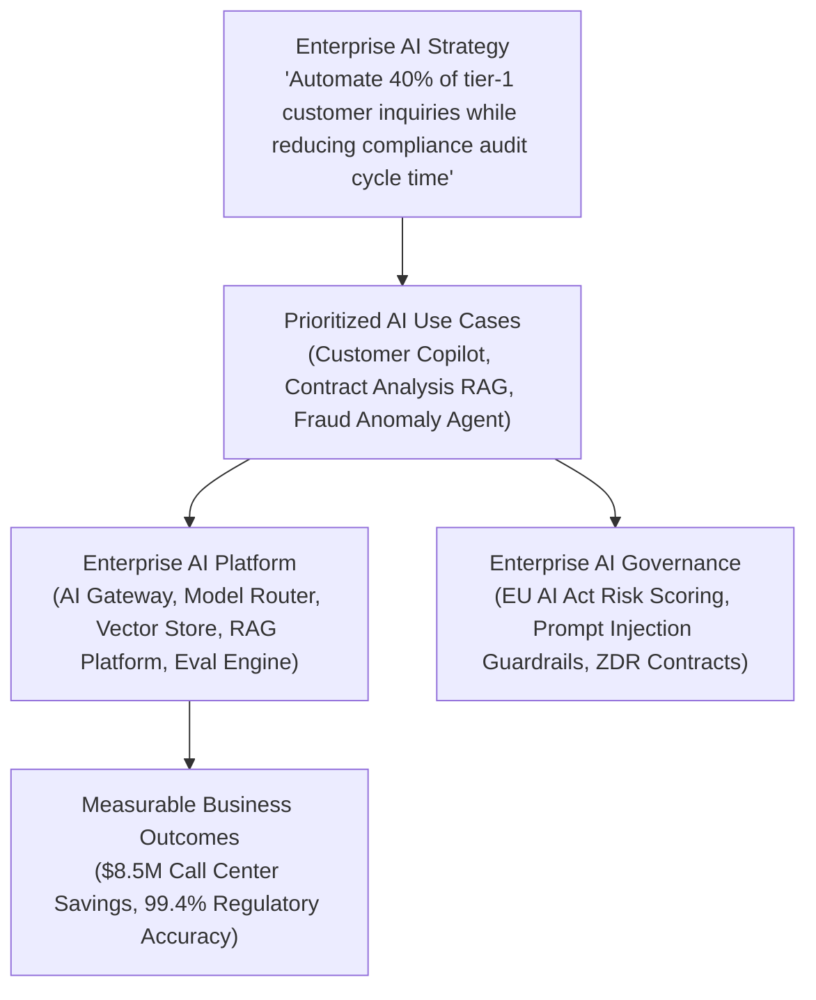

# Enterprise AI Strategy & Capability Mapping

Connecting executive AI enthusiasm to practical, high-ROI business capabilities while mitigating existential corporate risk.

---

## 1. The Strategy-to-AI-Platform Hierarchy

---

## 2. The Golden Rule of Enterprise AI
> **"Do not use AI when deterministic logic or traditional software engineering works better, cheaper, and faster."**
* AI should be used for unstructured text, reasoning, synthesis, and creative generation.
* Core transaction processing, financial ledgers, tax calculation, and access control must remain **100% deterministic**.
