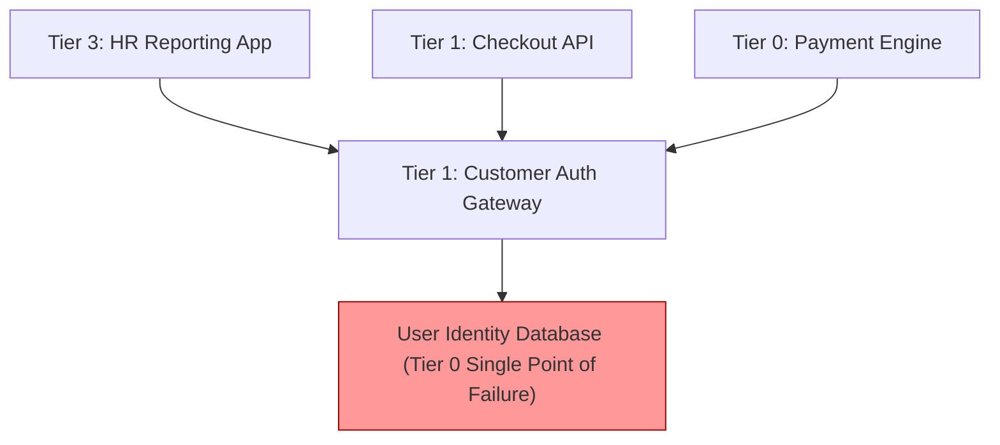

# Application Criticality & Dependency Modeling

Determining the blast radius of system failures and establishing business-aligned availability tiers.

---

## 1. The Enterprise Application Criticality Tiers

| Tier | Classification | Target Availability | Max RTO | Max RPO | Business Impact of Failure | Example Application |
| :---: | :--- | :---: | :---: | :---: | :--- | :--- |
| **Tier 0** | **Catastrophic / Mission-Critical** | 99.999% (5 Nines) | < 1 min | 0 (Zero Loss) | Immediate regulatory sanctions, brand destruction, massive financial loss. | Core Payment Settlement Ledger |
| **Tier 1** | **Business-Critical** | 99.95% | < 15 min | < 1 min | Direct customer disruption, material revenue loss. | Customer Mobile Banking App |
| **Tier 2** | **Business-Operational** | 99.9% | < 4 hours | < 15 min | Operational friction, employee productivity blocked, manual workarounds exist. | Internal Call Center CRM |
| **Tier 3** | **Administrative / Non-Critical** | 99.0% | < 24 hours | < 24 hours | Minor inconvenience, internal reporting delayed. | Employee Expense Reporting Portal |

---

## 2. Dependency Blast Radius Analysis

> **Architectural Rule of Dependency Ordering**: A Tier-$N$ application must **never** synchronously depend on a system of lower criticality (Tier $N+1$). If a Tier-1 checkout system calls a Tier-3 loyalty points service, a failure in loyalty points must degrade gracefully without blocking checkout.
