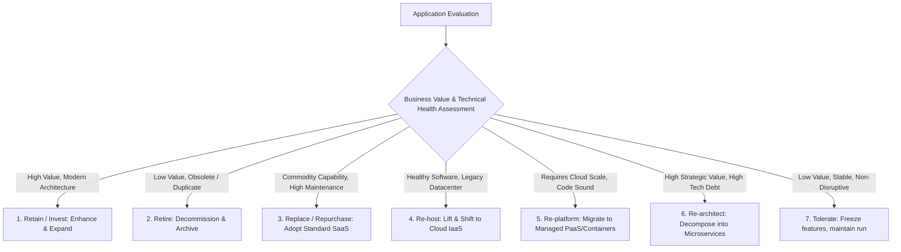

# Application Rationalization: The 7R Decision Framework

A systematic strategy for determining the disposition of every legacy application in the enterprise portfolio.

---

## 1. The 7R Rationalization Taxonomy

---

## 2. Cross-Phase Reference
For deep technical strangler-fig migration patterns, database decoupling, and cutover playbooks, see **[15-modernization](../../15-modernization/README.md)**.
