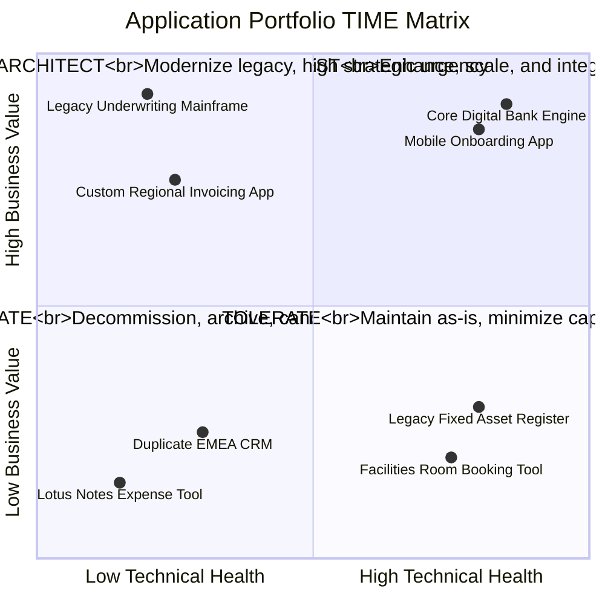

# Application Health vs Value Matrix (The TIME Model)

The industry-standard Gartner TIME model categorizes software assets into four actionable investment quadrants.

---

## 1. The TIME Portfolio Quadrant

---

## 2. Action Playbooks by Quadrant

1. **INVEST (High Value, High Health)**:
   * Allocate primary innovation budgets. Extend capabilities via APIs, AI enablers, and feature enhancements.
2. **MIGRATE / RE-ARCHITECT (High Value, Low Health)**:
   * High priority modernization candidates. The business cannot survive without this capability, but the technology platform is a ticking operational timebomb. Allocate capital to strangler-fig re-architecting.
3. **TOLERATE (Low Value, High Health)**:
   * Stable, commodity utilities that cost little to maintain and run reliably. Do NOT spend capital modernizing them; leave them in run mode.
4. **ELIMINATE (Low Value, Low Health)**:
   * Technical debt sinks that provide negligible business return. Decommission immediately, consolidate onto standard SaaS, or turn off.
