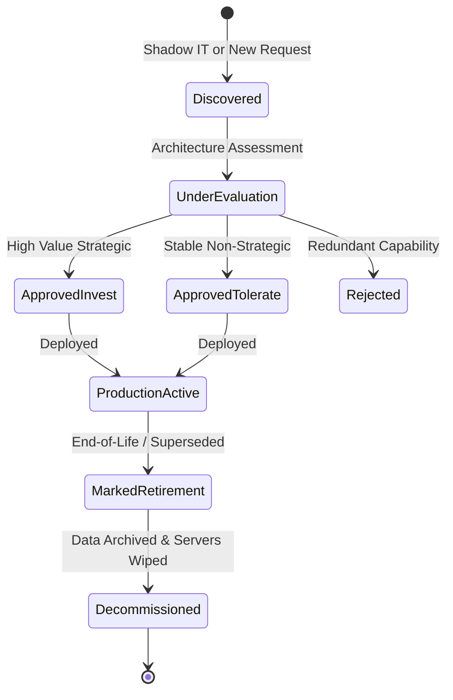

# Application Portfolio Management (APM) Discipline

How modern Enterprise Architecture offices manage application inventories as financial portfolios rather than static inventories.

---

## 1. Core APM Lifecycle Stages

---

## 2. Mandatory Application Registry Attributes
Every application record in the APM tool (e.g., LeanIX, ServiceNow APM) must maintain:
* **Business Dimension**: Owning Business Unit, Primary Capability, Secondary Capabilities, User Count, Business Criticality.
* **Technical Dimension**: Architecture Style, Primary Language/Framework, Database Engine, Hosting Type, Open Source Licenses.
* **Financial Dimension**: Annual Software Licensing, Cloud/Infrastructure Cost, Annual Support & Maintenance, TCO.
* **Risk Dimension**: Security Classification, Disaster Recovery Plan, CVE Vulnerability Count, Vendor Contract Expiration Date.
