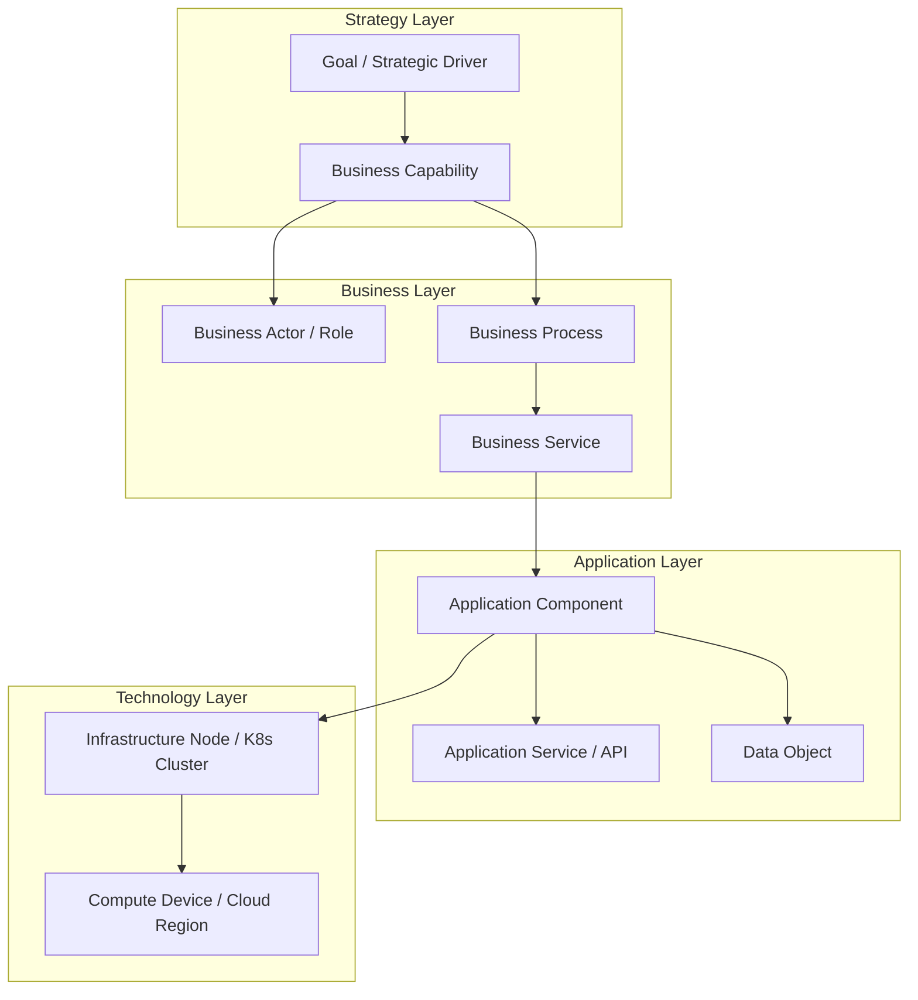

# ArchiMate 3.2 Core Concepts & Viewpoints

How Enterprise Architects use ArchiMate notation to communicate cross-layer enterprise relationships clearly.

---

## 1. The ArchiMate Core Layers

---

## 2. Core ArchiMate Relationships
* **Composition ($ullet-$)**: Element consists of other elements (e.g., Capability consists of Sub-capabilities).
* **Realization ($--	riangleright$)**: A lower-level element realizes a higher-level behavior (e.g., Application Component realizes a Business Service).
* **Serving ($
ightarrow$)**: An element provides functionality to another element (e.g., API Gateway serves the Mobile App).
* **Access ($\cdots
ightarrow$)**: An application component reads or writes a Data Object.

---

## 3. Essential Enterprise Viewpoints
1. **Capability Map Viewpoint**: Decomposes Level-1 to Level-3 business capabilities.
2. **Application Cooperation Viewpoint**: Illustrates data flows and API dependencies between systems.
3. **Layered Viewpoint**: Connects Business Actors $	o$ Applications $	o$ Infrastructure Nodes in a single end-to-end trace.
