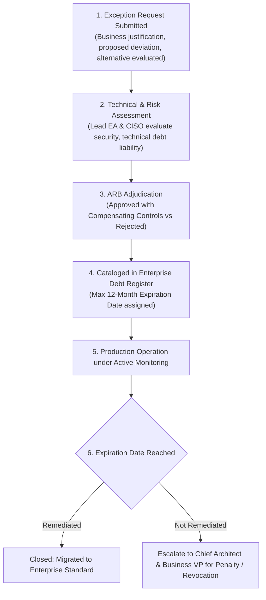

# Architecture Exception Lifecycle

Exceptions prevent governance gridlock while maintaining enterprise accountability.

---

## 1. The Exception Governance Workflow

---

## 2. Core Exception Invariants
* **Zero Indefinite Exceptions**: Every exception has a hard expiration date (maximum 12 months).
* **Funded Remediation**: No exception is granted without an executive-signed commitment to fund remediation in a future sprint.
* **Compensating Controls**: Any deviation from security standards mandates compensating technical guardrails (e.g., enhanced WAF inspection, isolated network enclave).
