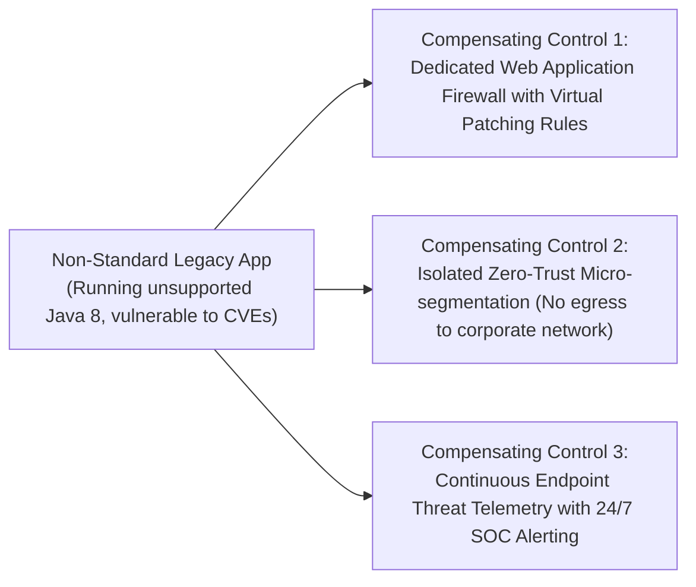

# Risk Acceptance & Compensating Controls

When an architecture exception is granted, the business must formally accept financial and security liability.

---

## 1. Compensating Controls Architecture

If an application cannot meet an enterprise standard, it must deploy compensating controls to neutralize the blast radius:

---

## 2. Formal Risk Acceptance Signature
The Business Unit VP must sign a formal legal liability statement:
> *"I accept the operational and security risks associated with running System X on unpatched software. In the event of a breach or compliance fine resulting from this exception, my business unit assumes financial responsibility for remediation."*
